# LSST/Rubin Reuse Prototype — From Scratch to the Demo

This document explains the system from first principles before talking about the demo scaffold.

The goal is not to “run a demo” first. The goal is to understand the architecture you are reusing, then see how each demo component corresponds to one LSST/Rubin concept.

Scripts are [here](https://github.com/ejoliet/lsst-reusable-demo).

---

## 1. What problem are we solving?

You want to build a survey-processing pipeline that reuses Rubin/LSST Science Pipelines in the same general spirit as Subaru/HSC: keep the LSST framework, reuse the mature image-processing algorithms, and customize only the survey-specific pieces.

At a high level, the system transforms astronomical images through stages like this:

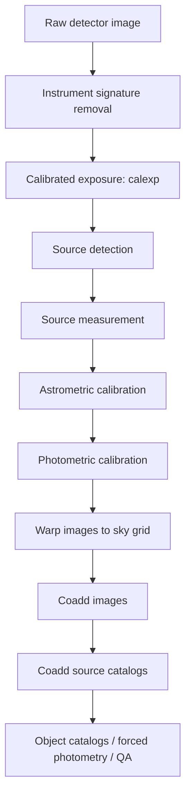

The key point: LSST does not want you to hand-pass file paths between scripts. It wants you to describe data products, tasks, and collections, then let Butler and `pipetask` execute the graph.

---

## 2. Start with the data model, not the demo

### 2.1 Exposure

An **exposure** is a single astronomical image plus the metadata needed to process it correctly.

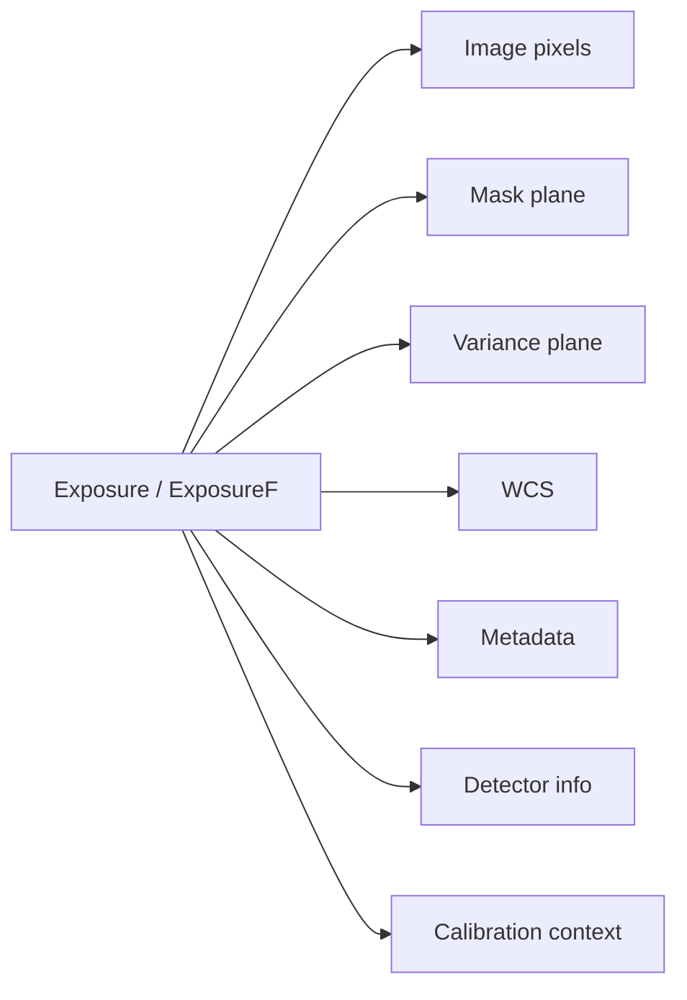

Common dataset types:

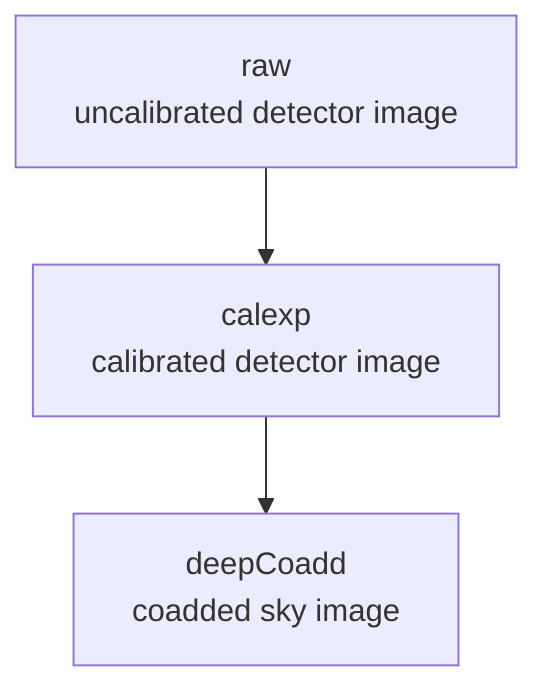

Rubin’s getting-started documentation uses dataset types such as `raw`, `calexp`, and `deepCoadd` to describe the processing role of image products.

---

### 2.2 DatasetType

A **DatasetType** names the role of a dataset in the pipeline.

Examples:

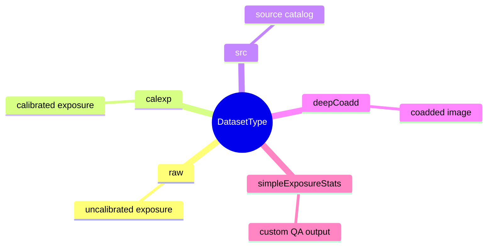

In a normal Python pipeline, you might hard-code files:

```python
image = read_fits("some/file.fits")
result = calibrate(image)
write_fits(result, "some/output.fits")
```

In LSST/Rubin style, your task declares typed inputs and outputs instead:

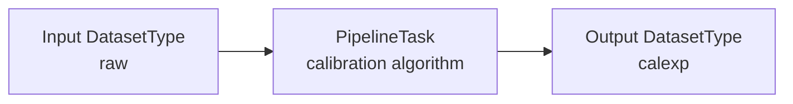

The framework decides which physical file corresponds to `raw`, where `calexp` is written, and how it is indexed.

---

### 2.3 Data ID

A **data ID** identifies one concrete dataset instance.

Example:

```text
{instrument: HSC, visit: 903342, detector: 10}
```

A complete dataset reference is not just `calexp`. It is:

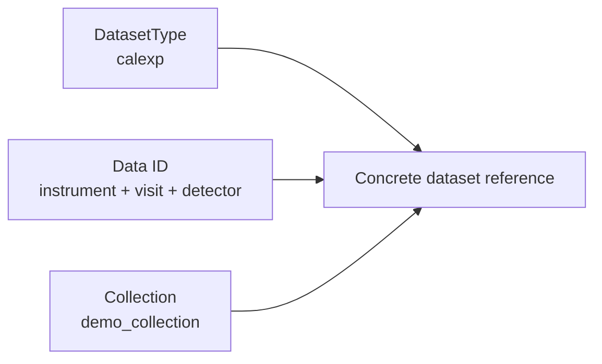

So this means:

```text
calexp + {instrument: HSC, visit: 903342, detector: 10} + demo_collection
```

---

### 2.4 Collection

A **collection** is a named grouping of datasets. Treat it as a versioned processing namespace.

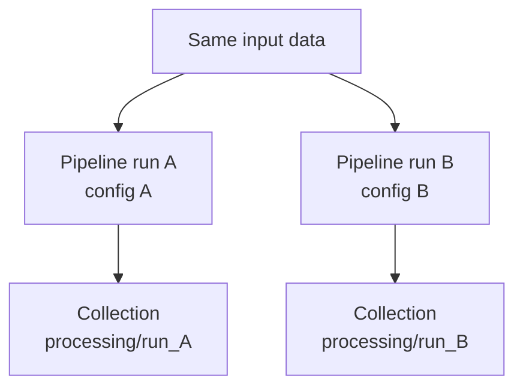

Collections let you avoid overwriting previous outputs. You can run the same pipeline several times with different configs and write results into different collections.

This matters because scientific processing is iterative. You need to preserve provenance, compare runs, and know which config produced which result.

---

## 3. Butler: the data access layer

Butler is the LSST/Rubin data access system.

It answers questions like:

- Where is this raw image?
- Where is the calibrated image?
- What datasets exist?
- Which collection contains this output?
- What data IDs are valid?
- How do I read this dataset into Python?
- How do I write a new output dataset?

In ordinary software terms:

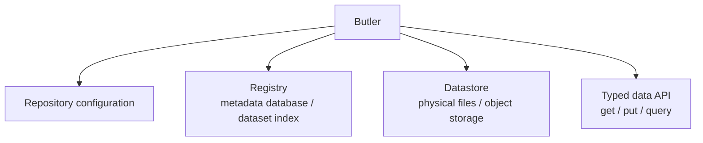

Minimal Python pattern:

```python
from lsst.daf.butler import Butler

butler = Butler("/path/to/repo")
registry = butler.registry

for collection in registry.queryCollections():
    print(collection)

for ref in registry.queryDatasets("calexp", collections="demo_collection"):
    print(ref.dataId)

calexp = butler.get(
    "calexp",
    dataId={"instrument": "HSC", "visit": 903342, "detector": 10},
    collections="demo_collection",
)
```

In practice, the exact dimensions depend on the repository and instrument.

---

## 4. PipelineTask: the algorithm unit

A **PipelineTask** is the reusable processing unit.

It declares inputs, outputs, dimensions, configuration, and algorithm implementation.

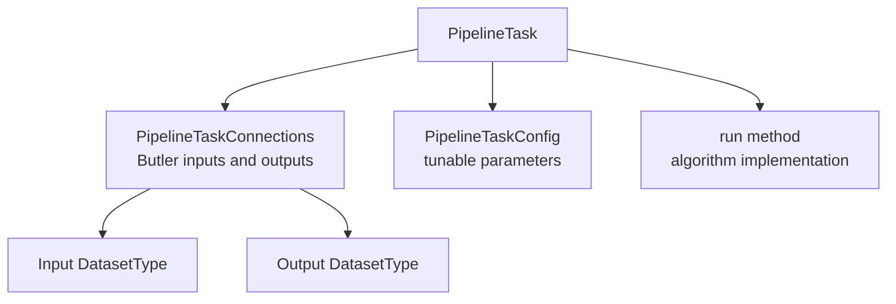

A simplified mental model:

```python
class SomeTask(PipelineTask):
    inputs = ["raw"]
    outputs = ["calexp"]

    def run(self, raw):
        return calibrate(raw)
```

Real LSST `PipelineTask` classes are more structured. They use connection classes to declare Butler inputs and outputs.

For example, our scaffold task does this:

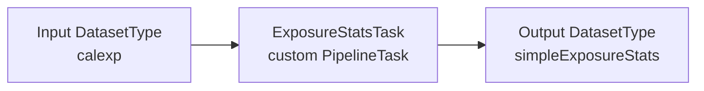

That means it does not manually open a FITS file. It receives a Butler-loaded calibrated exposure, computes QA statistics, and writes a Butler-managed result.

---

## 5. Pipeline YAML: the task wiring layer

A **pipeline YAML** file tells Rubin which task classes to run and how to configure them.

Minimal example from the scaffold:

```yaml
description: "Run a custom QA PipelineTask against LSST ProcessCcd calexp outputs."

tasks:
  exposureStats:
    class: your_survey.tasks.exposure_stats.ExposureStatsTask
    config:
      thresholdSigma: 5.0
```

This does not contain the algorithm. It points to the Python class and configures it.

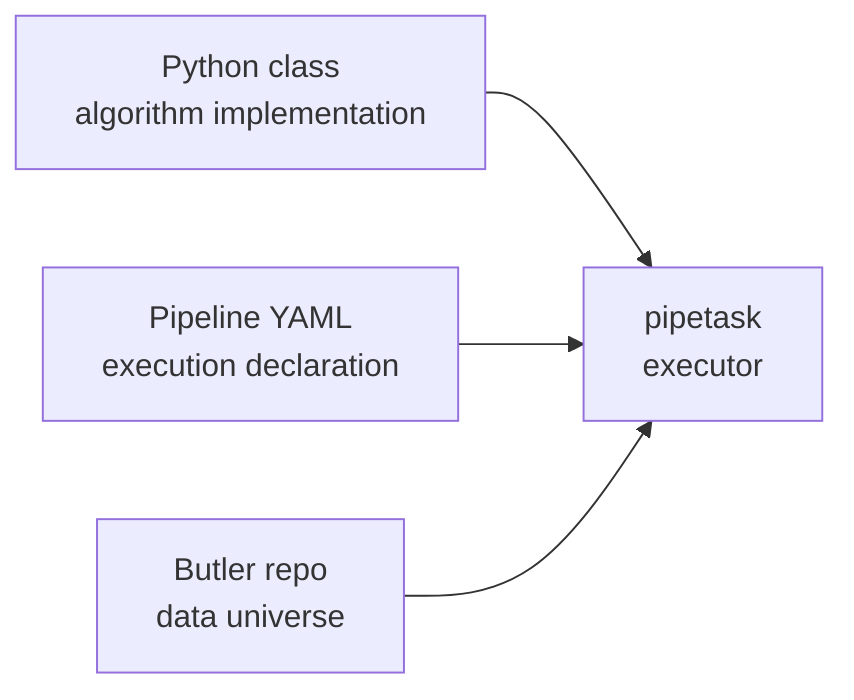

---

## 6. pipetask: the execution engine CLI

`pipetask` is the command-line execution layer.

Generic shape:

```bash
pipetask run \
  -b /path/to/butler/repo \
  -i input_collection \
  -o output_collection \
  -p pipeline.yaml \
  --register-dataset-types
```

Conceptually:

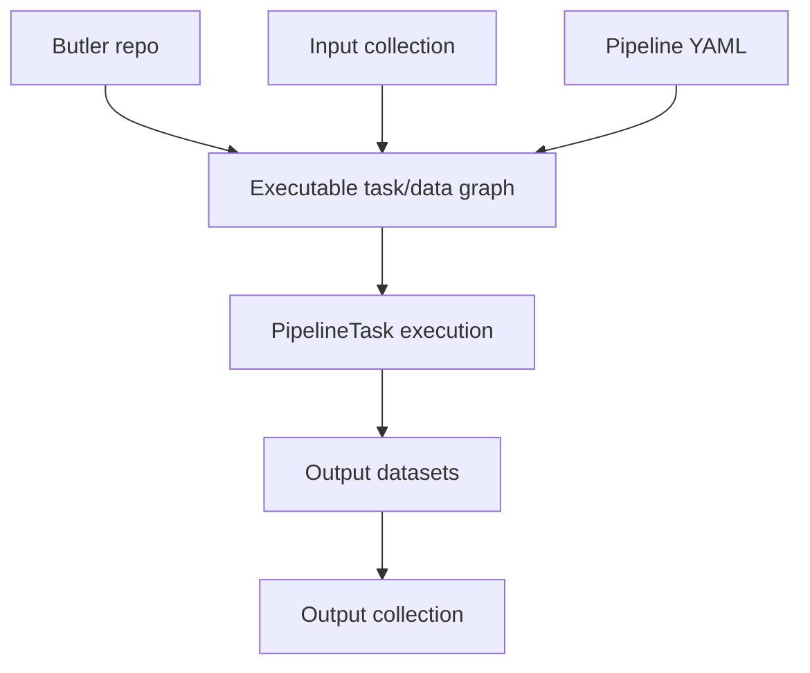

The important idea is that `pipetask` does not just run one script. It builds a task/data graph from the Butler registry and the pipeline definition.

---

## 7. The whole architecture before the demo

From scratch, the architecture is this:

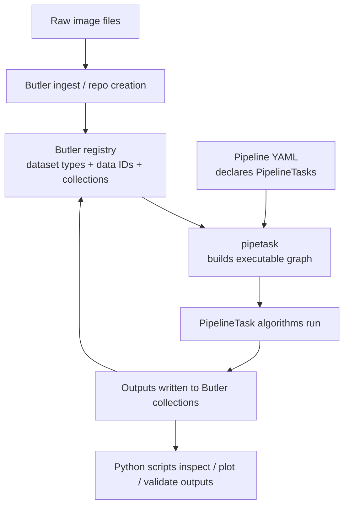

The reusable LSST/Rubin pieces are:

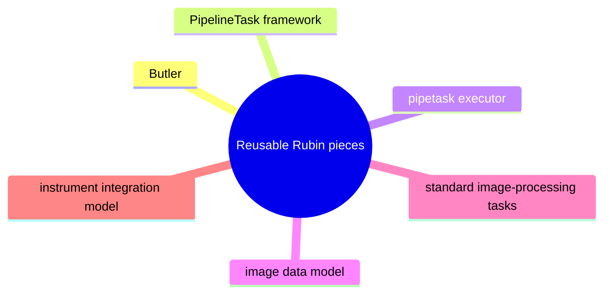

Your custom pieces are usually:

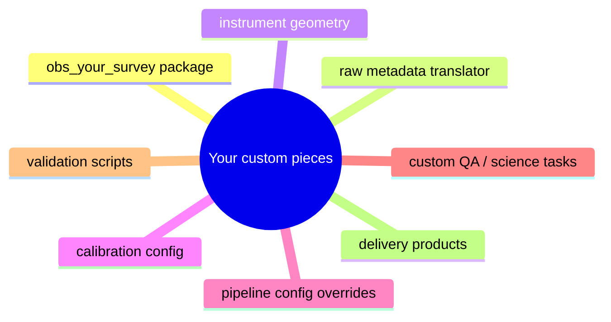

---

## 8. Now introduce the demo: why it exists

The demo is not the architecture. The demo is a small proof that the architecture works.

It answers these questions:

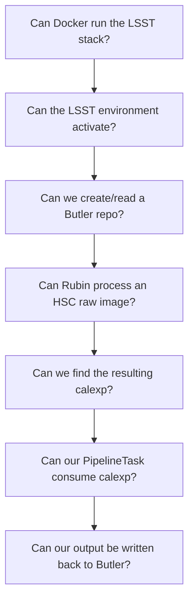

So the demo is a vertical slice:

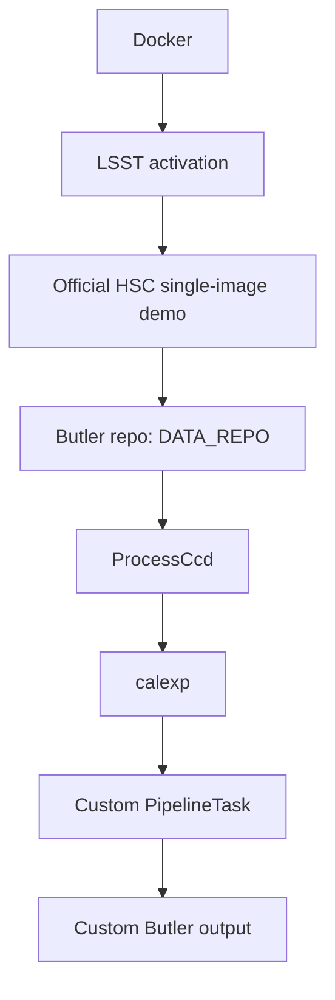

---

## 9. Demo component 1: Docker shell

Files:

```text
Makefile
scripts/lsst_env.sh
```

Purpose: start a controlled LSST/Rubin runtime without installing the stack natively on macOS.

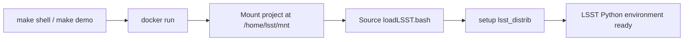

Why the wrapper exists:

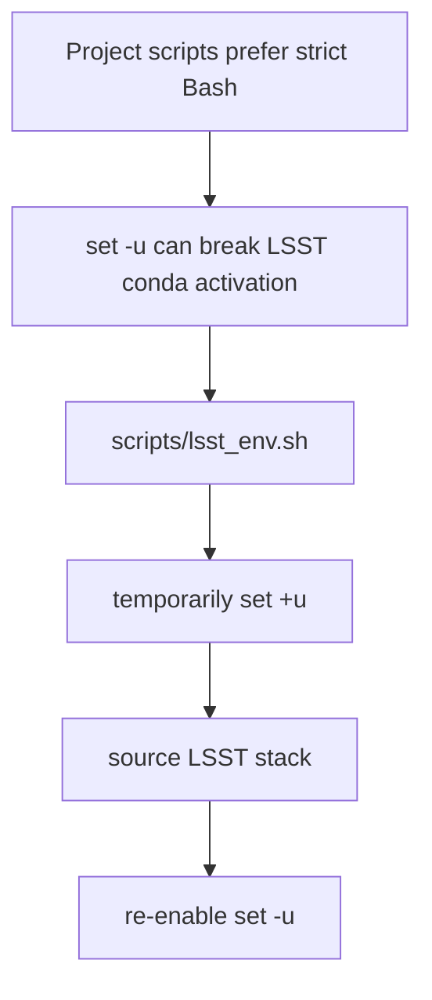

Developer modification points:

- Change `IMAGE` in `Makefile`.
- Add platform override for Apple Silicon if needed.
- Add extra mounted volumes for large datasets.
- Add local cache directories.

---

## 10. Demo component 2: official HSC processing demo

File:

```text
scripts/01_run_official_hsc_demo.sh
```

Purpose: use a known-good Rubin demo dataset before adding custom survey code.

The official Rubin demo does this:

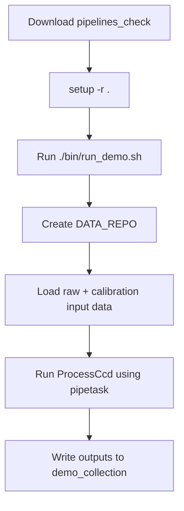

The official documentation says the demo creates a Butler repository under `DATA_REPO`, processes data with `pipetask` using the `ProcessCcd` pipeline, writes outputs to `demo_collection`, and uses one HSC raw image.

Developer modification points:

- Change `DEMO_REF` to match the LSST stack version.
- Replace `pipelines_check` with `rc2_subset` for larger processing.
- Use a local checked-out demo instead of downloading each time.

Do not customize algorithms here yet. This step is only a baseline integration test.

---

## 11. Demo component 3: inspect the Butler repo

Files:

```text
python/your_survey/inspect_repo.py
scripts/02_inspect_butler.sh
```

Purpose: show what data products exist after the official demo runs.

```mermaid
flowchart TD
    Repo[DATA_REPO]
    Butler[Butler(repo)]
    Registry[butler.registry]
    Collections[queryCollections]
    Types[queryDatasetTypes]
    Refs[queryDatasets]
    Output[Developer-readable report]

    Repo --> Butler --> Registry
    Registry --> Collections --> Output
    Registry --> Types --> Output
    Registry --> Refs --> Output
```

This script answers:

- What collections exist?
- What dataset types exist?
- Which data IDs exist?
- Did the demo create `calexp`?
- Where did our outputs go?

Developer modification points:

- Change dataset type filter: `raw`, `calexp`, `src`, `simpleExposureStats`.
- Change collection: `demo_collection`, `your_survey/stats`.
- Add data ID filtering.
- Print storage classes.
- Print dimensions.
- Export summary as JSON.

This is one of the most important scripts. Before adding tasks, always inspect what exists in Butler.

---

## 12. Demo component 4: custom PipelineTask

Files:

```text
python/your_survey/tasks/exposure_stats.py
pipelines/exposure_stats.yaml
scripts/03_run_custom_stats_task.sh
```

Purpose: show how your own algorithm plugs into the Rubin execution model.

The custom task does not do source extraction or coaddition. It intentionally does something simpler:

```mermaid
flowchart LR
    Calexp[Read calexp]
    Stats[Compute image statistics]
    Bright[Count toy bright pixels]
    Output[Write simpleExposureStats]

    Calexp --> Stats --> Bright --> Output
```

Why this is useful:

```mermaid
flowchart TD
    P1[Proves custom code can consume LSST data products through Butler]
    P2[Proves custom code can be run by pipetask]
    P3[Proves custom code can write new Butler-managed datasets]

    P1 --> P2 --> P3
```

Important class pieces:

```mermaid
classDiagram
    class ExposureStatsConnections {
      +Input calexp
      +Output simpleExposureStats
      +dimensions instrument, visit, detector
    }

    class ExposureStatsConfig {
      +thresholdSigma: float
    }

    class ExposureStatsTask {
      +run(calexp)
      +returns summary
    }

    ExposureStatsTask --> ExposureStatsConnections
    ExposureStatsTask --> ExposureStatsConfig
```

Pipeline YAML:

```yaml
tasks:
  exposureStats:
    class: your_survey.tasks.exposure_stats.ExposureStatsTask
    config:
      thresholdSigma: 5.0
```

Execution command:

```bash
pipetask run \
  -b "$REPO" \
  -i demo_collection \
  -o your_survey/stats \
  -p pipelines/exposure_stats.yaml \
  --register-dataset-types
```

Meaning:

```mermaid
flowchart LR
    B[-b<br/>Butler repo]
    I[-i<br/>input collection with calexp]
    O[-o<br/>output collection]
    P[-p<br/>pipeline YAML]
    R[--register-dataset-types<br/>allow new output type]
    Run[pipetask run]

    B --> Run
    I --> Run
    O --> Run
    P --> Run
    R --> Run
```

Developer modification points:

- Change input dataset type.
- Change output dataset type.
- Change dimensions.
- Change storage class.
- Add config fields.
- Replace toy algorithm with real QA/science logic.

---

## 13. Demo component 5: inspect the custom output

Files:

```text
scripts/04_inspect_stats_output.sh
python/your_survey/inspect_repo.py
```

Purpose: verify that our custom task wrote a Butler dataset.

Expected logical output:

```mermaid
flowchart TD
    Coll[Collection<br/>your_survey/stats]
    Type[DatasetType<br/>simpleExposureStats]
    DataID[Data ID<br/>instrument + visit + detector]
    Values[Values<br/>mean, median, std, robust_sigma, toy_bright_pixel_count]

    Coll --> Type --> DataID --> Values
```

This confirms the full loop:

```mermaid
sequenceDiagram
    participant LSST as Official LSST output
    participant Task as Custom PipelineTask
    participant Butler as Butler repository
    LSST->>Task: calexp
    Task->>Task: compute summary metrics
    Task->>Butler: write simpleExposureStats
    Butler-->>Task: registered dataset ref
```

---

## 14. Demo component 6: image preview

File:

```text
python/your_survey/plot_calexp.py
```

Purpose: retrieve the first `calexp` from Butler and save a PNG preview.

```mermaid
flowchart LR
    Query[query calexp refs]
    Get[butler.get first calexp]
    Array[extract image array]
    Scale[percentile scale]
    PNG[write PNG]

    Query --> Get --> Array --> Scale --> PNG
```

This is not part of the pipeline execution graph. It is a developer inspection tool.

Developer modification points:

- Choose a specific data ID.
- Plot mask planes.
- Plot variance plane.
- Overlay detected sources.
- Export FITS cutouts.
- Add QA panels.

---

## 15. How the pieces get built together

### Stage A: Environment

```mermaid
flowchart LR
    Makefile[Makefile]
    Docker[docker run]
    Env[scripts/lsst_env.sh]
    Stack[LSST stack active]

    Makefile --> Docker --> Env --> Stack
```

### Stage B: Known-good baseline processing

```mermaid
flowchart LR
    DemoScript[scripts/01_run_official_hsc_demo.sh]
    Check[pipelines_check]
    Repo[DATA_REPO]
    Process[ProcessCcd]
    Calexp[demo_collection / calexp]

    DemoScript --> Check --> Repo --> Process --> Calexp
```

### Stage C: Repository understanding

```mermaid
flowchart LR
    InspectScript[scripts/02_inspect_butler.sh]
    Collections[collections]
    Types[dataset types]
    Refs[dataset refs]

    InspectScript --> Collections
    InspectScript --> Types
    InspectScript --> Refs
```

### Stage D: Custom extension

```mermaid
flowchart TD
    TaskCode[python/your_survey/tasks/exposure_stats.py]
    PipelineYAML[pipelines/exposure_stats.yaml]
    RunScript[scripts/03_run_custom_stats_task.sh]
    Pipetask[pipetask]
    Output[simpleExposureStats]

    TaskCode --> Pipetask
    PipelineYAML --> Pipetask
    RunScript --> Pipetask
    Pipetask --> Output
```

### Stage E: Validation

```mermaid
flowchart LR
    StatsInspect[scripts/04_inspect_stats_output.sh]
    Plot[python/your_survey/plot_calexp.py]
    Confirm[Confirm output dataset and visual sanity]

    StatsInspect --> Confirm
    Plot --> Confirm
```

Complete mental model:

```mermaid
flowchart TD
    Runtime[Docker runtime<br/>contains LSST Science Pipelines]
    Repo[Butler repo<br/>raw, calibration, output datasets]
    YAML[Pipeline YAML<br/>declares tasks]
    Exec[pipetask<br/>executes over Butler datasets]
    Task[PipelineTask<br/>one algorithmic step]
    Collections[Collections<br/>separate inputs and outputs]

    Runtime --> Exec
    Repo --> Exec
    YAML --> Exec
    Exec --> Task
    Task --> Collections
    Collections --> Repo
```

---

## 16. Where source extraction fits

Source extraction is not implemented by the custom demo task because Rubin already has mature tasks for that.

In real processing, source detection and measurement happen after calibrated exposures exist.

```mermaid
flowchart LR
    Raw[raw]
    ISR[ISR]
    Char[characterize image]
    Cal[calibrate image]
    Calexp[calexp]
    Detect[detect sources]
    Measure[measure sources]
    Catalog[source catalog]

    Raw --> ISR --> Char --> Cal --> Calexp --> Detect --> Measure --> Catalog
```

What you should do next:

```mermaid
flowchart TD
    Tiny[pipelines_check<br/>tiny integration proof]
    RC2[rc2_subset<br/>larger HSC tutorial data]
    SingleFrame[single-frame processing]
    Src[source catalogs]
    Custom[custom source-level tasks]

    Tiny --> RC2 --> SingleFrame --> Src --> Custom
```

Do not write your own source extraction first. Reuse Rubin’s detection and measurement tasks unless your science case requires a different algorithm.

---

## 17. Where astrometry fits

Astrometric calibration is part of the calibrated exposure path.

```mermaid
flowchart LR
    Raw[raw image]
    Instrument[Instrumental corrections]
    Detect[Source detection for calibration]
    Match[Reference catalog matching]
    WCS[WCS solution]
    Calexp[calexp with usable WCS]

    Raw --> Instrument --> Detect --> Match --> WCS --> Calexp
```

Your customization points are usually:

```mermaid
mindmap
  root((Astrometry customization))
    reference catalog choice
    matching configuration
    WCS validation
    instrument metadata correctness
    QA thresholds
```

The dangerous part is usually not the astrometry algorithm itself. It is the input metadata:

```mermaid
flowchart TD
    BadMeta[Bad input metadata]
    Geometry[bad detector geometry]
    Boresight[bad boresight]
    Filter[bad filter metadata]
    Timing[bad exposure timing]
    Translator[bad raw header translator]
    Visit[bad visit definition]
    BadWCS[bad WCS / failed astrometry]

    BadMeta --> Geometry --> BadWCS
    BadMeta --> Boresight --> BadWCS
    BadMeta --> Filter --> BadWCS
    BadMeta --> Timing --> BadWCS
    BadMeta --> Translator --> BadWCS
    BadMeta --> Visit --> BadWCS
```

For a custom survey, fix the instrument model before blaming the astrometry task.

---

## 18. Where coadds fit

Coadds require multiple exposures mapped onto a sky grid.

```mermaid
flowchart LR
    Calexp[calexp images]
    SkyMap[Define sky map / tract / patch]
    Warp[Make warps]
    Coadd[Assemble coadd]
    Detect[Detect on coadd]
    Deblend[Deblend]
    Measure[Measure]
    Forced[Forced photometry]

    Calexp --> SkyMap --> Warp --> Coadd --> Detect --> Deblend --> Measure --> Forced
```

The one-image `pipelines_check` demo is too small for meaningful coadd work.

```mermaid
flowchart TD
    PipelinesCheck[pipelines_check<br/>tiny integration proof]
    RC2[rc2_subset<br/>realistic source/coadd workflow]

    PipelinesCheck --> RC2
```

---

## 19. What you modify first

Modify in this order.

```mermaid
flowchart TD
    A[1. Change inspection behavior<br/>inspect_repo.py]
    B[2. Change custom task config<br/>exposure_stats.py + exposure_stats.yaml]
    C[3. Add a second custom task]
    D[4. Move to rc2_subset]
    E[5. Create obs_your_survey]

    A --> B --> C --> D --> E
```

### 1. Change inspection behavior

File:

```text
python/your_survey/inspect_repo.py
```

Add JSON output, filters by detector/visit, dimension printing, and storage-class summaries.

### 2. Change custom task configuration

Files:

```text
python/your_survey/tasks/exposure_stats.py
pipelines/exposure_stats.yaml
```

Add mask-aware stats, variance-aware stats, WCS metadata checks, or PSF summary checks.

### 3. Add a second custom task

Example:

```text
CalexpFootprintQaTask
```

Input: `calexp`.

Output: `calexpFootprintQa`.

Purpose: check image footprint, bounding box, WCS presence, mask fraction, and NaN fraction.

### 4. Move to rc2_subset

Replace the tiny demo with Rubin’s larger HSC tutorial data. Then start working with single-frame processing, source catalogs, warps, coadds, coadd catalogs, and forced photometry.

### 5. Only then create obs_your_survey

A custom `obs_*` package is the real Subaru-like step, but it is premature until you understand Butler and PipelineTask execution.

```mermaid
mindmap
  root((obs_your_survey minimum concerns))
    camera geometry
    detector IDs
    filter names
    raw FITS translator
    visit definition
    calibration products
    reference catalog config
    pipeline config overrides
```

---

## 20. What not to modify first

Avoid starting here:

```mermaid
flowchart TD
    Start[High-risk first modifications]
    Coadd[custom coadd algorithm]
    Astro[custom astrometric solver]
    Extract[custom source extractor]
    Layout[custom file layout]
    Datastore[custom Butler datastore]
    Obs[custom instrument package before understanding data IDs]

    Start --> Coadd
    Start --> Astro
    Start --> Extract
    Start --> Layout
    Start --> Datastore
    Start --> Obs
```

Start here instead:

```mermaid
flowchart LR
    Inspect[inspect Butler]
    Read[read calexp]
    Write[write small output dataset]
    Modify[modify one PipelineTask]
    Run[run through pipetask]
    InspectOut[inspect output collection]

    Inspect --> Read --> Write --> Modify --> Run --> InspectOut
```

---

## 21. Developer mental model

If you know Airflow, Kubernetes, or build systems, this analogy helps:

```mermaid
flowchart TD
    Butler[Butler repo<br/>artifact registry + metadata DB]
    DatasetType[DatasetType<br/>typed artifact name]
    DataID[Data ID<br/>artifact coordinate]
    Collection[Collection<br/>run namespace]
    Task[PipelineTask<br/>task/operator implementation]
    YAML[Pipeline YAML<br/>DAG/task declaration]
    Pipetask[pipetask<br/>graph builder + executor]
    Calexp[calexp<br/>calibrated image artifact]

    Butler --> DatasetType
    DatasetType --> DataID
    DataID --> Collection
    YAML --> Pipetask
    Task --> Pipetask
    Pipetask --> Calexp
    Calexp --> Butler
```

So the custom development loop becomes:

```mermaid
flowchart LR
    I[1. Inspect available inputs]
    D[2. Declare task inputs/outputs]
    R[3. Write PipelineTask.run]
    C[4. Expose config]
    Y[5. Wire YAML]
    P[6. Run pipetask]
    O[7. Inspect output collection]
    Repeat[8. Repeat]

    I --> D --> R --> C --> Y --> P --> O --> Repeat --> I
```

---

## 22. Final big picture

The demo should be understood as three nested systems:

```mermaid
flowchart TD
    subgraph S1[System 1: LSST/Rubin framework]
        Butler[Butler]
        PipelineTask[PipelineTask]
        Pipetask[pipetask]
        ImageModel[image data model]
        Collections[collections]
    end

    subgraph S2[System 2: Official HSC demo]
        HSC[one HSC raw image]
        DataRepo[DATA_REPO]
        ProcessCcd[ProcessCcd]
        DemoCollection[demo_collection]
        DemoCalexp[calexp]
    end

    subgraph S3[System 3: Your extension]
        CustomTask[custom PipelineTask]
        CustomYAML[custom pipeline YAML]
        CustomDataset[custom output dataset]
        Validation[validation / inspection scripts]
    end

    S1 --> S2 --> S3
```

Do not think of this as:

```mermaid
flowchart LR
    Demo[run demo] --> Magic[magic happened]
```

Think of it as:

```mermaid
flowchart LR
    Butler2[Butler stores typed image products]
    Tasks2[PipelineTasks transform typed products]
    Pipetask2[pipetask runs transformations]
    Collections2[Collections separate processing runs]
    Demo2[Demo gives one known-good HSC input and calexp]
    Custom2[Your task attaches safely]

    Butler2 --> Tasks2 --> Pipetask2 --> Collections2 --> Demo2 --> Custom2
```

---

## References

- Rubin/LSST getting-started tutorial: explains HSC sample data, Butler repositories, `raw`, `calexp`, `deepCoadd`, `PipelineTask`, and the progression toward coadds and catalogs: https://pipelines.lsst.io/getting-started/data-setup.html
- Rubin/LSST demo docs: explains `pipelines_check`, `DATA_REPO`, `ProcessCcd`, `pipetask`, `demo_collection`, and the one-image HSC input: https://pipelines.lsst.io/install/demo.html
- Butler module docs: describes Butler as an abstracted data access interface for reading/writing data without knowing file-format or file-location details: https://pipelines.lsst.io/modules/lsst.daf.butler/index.html
- `ctrl_mpexec` docs: entry point for command-line pipeline execution with `pipetask`: https://pipelines.lsst.io/modules/lsst.ctrl.mpexec/index.html
- Docker install docs: explains the Docker-based LSST Science Pipelines runtime and environment setup: https://pipelines.lsst.io/install/docker.html
